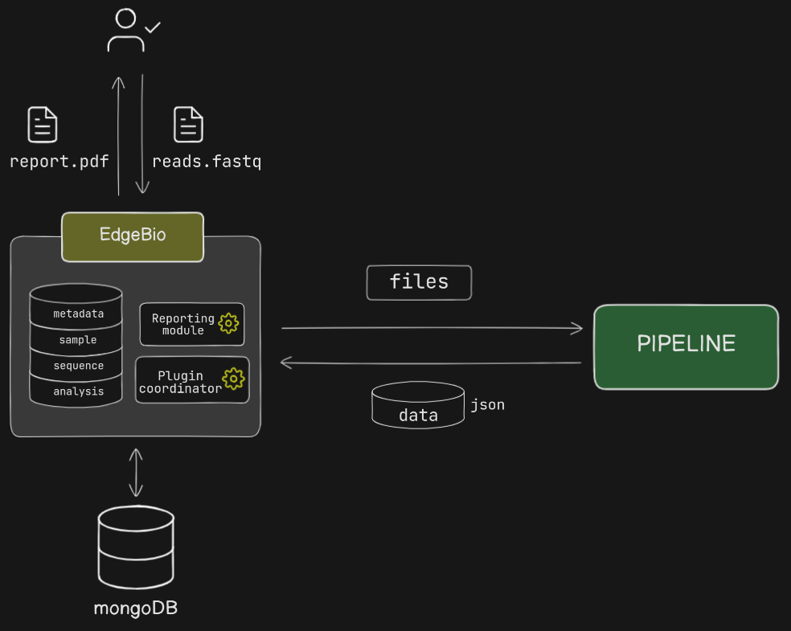

# About

## Background
Bioinformatics pipelines are typically Linux-operated and difficult to use without specialist training or dedicated compute power. Researchers often require an accessible and efficient way to process sequencing data without relying on high-performance computing clusters or extensive command-line knowledge.

## Project Overview
This application provides a local, easy-to-use platform for running bioinformatics pipelines. Designed to work on a small-form-factor Linux machine, such as an SBC NUC, it allows researchers to upload sequencing data, process it in real time, and manage jobs through a web-based interface. The system integrates a queue-based job management system and real-time updates via WebSockets.

## Key Features
- **File Upload & Processing** – Users can upload sequencing data for automated processing through configurable pipelines.
- **Job Queue & Management** – A broker-based queue system ensures job execution order and efficient resource usage.
- **Real-Time Monitoring** – WebSocket-based feedback provides live updates on pipeline execution and job status.
- **Scalability & Modularity** – Designed to integrate additional bioinformatics tools and adapt to evolving research needs.

## System Architecture
The system consists of a Next.js frontend for user interaction, an Express.js backend handling API requests and authentication, and a Python-based processing engine for executing bioinformatics workflows. A message broker manages job queues and WebSockets to provide real-time feedback.

> [For more detail: ](architecture.md) - System architecture, component diagrams.

## Technologies Used
- **Frontend:** Next.js
- **Backend:** Express.js, Node.js
- **Database:** MongoDB
- **Processing:** Python, Conda environment

## Use Cases
- Researchers needing a local, self-hosted solution for specialised high-throughput bioinformatics data processing.
- Labs requiring an easy-to-use system for handling sequencing data without a dedicated HPC.
- Institutions looking for a scalable, modular bioinformatics platform adaptable to various workflows.

## Future Development
- Expansion of supported bioinformatics pipelines.
- Improved user authentication and role-based access control.
- Enhanced logging and error-tracking mechanisms.
- Integration with cloud storage and external databases for data management.

